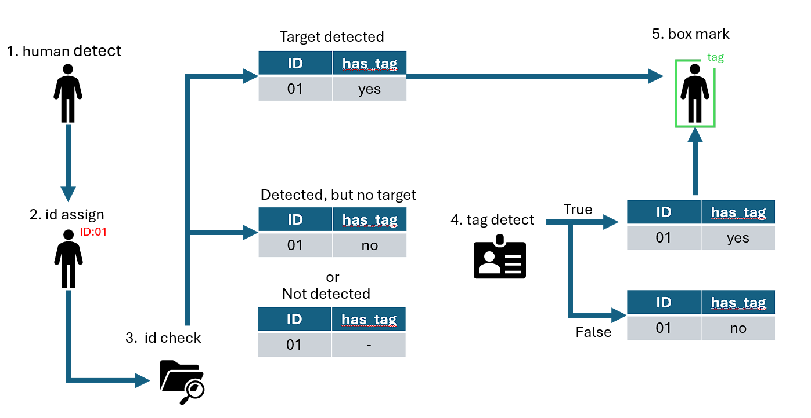

# README

## Scenario

偵測傳感器（監視器）的畫面中是否帶有目標識別物的任務，且訓練資料中有用於測試的影片。

## Requirements

* YOLOv8
* SORT

## 1. Data Preprocess

* 從影片中截取帶有目標識別物的圖片
* 對圖片進行標注，生成yolo格式的標簽

## 2. Data augmentation

缺乏訓練樣本，導致訓練模型缺乏汎用性，爲了解決模型過擬合的問題增加資料的差異性：

* 角度變化
* 垂直、水平翻轉
* 梯度變化
* 色彩增强

## 3. Model Train

使用YOLOv8 nano進行訓練  
`yolo detect train data=data.yaml model=yolov8n.pt epochs=50 imgsz=640`

## 4. Detect

1. 使用YOLO pretrain模型對影片中的物件(人物)進行檢測
2. 使用SORT對物件進行ID分配
3. 檢查物件ID是否曾經檢測出目標
   1. 如有，則在畫面框選
   2. 如無，則使用預先訓練的模型進行偵測
      1. 偵測成功，則標記物件ID，並在畫面框選
4. 框選帶有tag 標簽的物件

## Why SORT

使用SORT對影片中的物件(人物)進行標記，即使畫面中丟失目標識別物的信息，只要物件能夠被成功偵測，則能持續鎖定帶有目標識別物的追蹤  